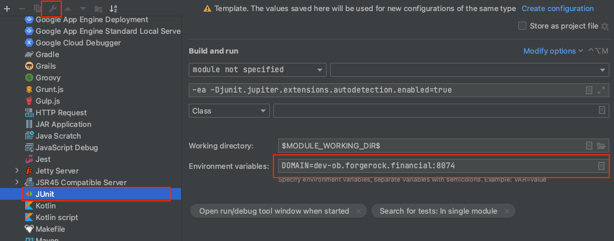
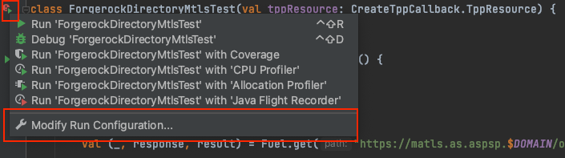
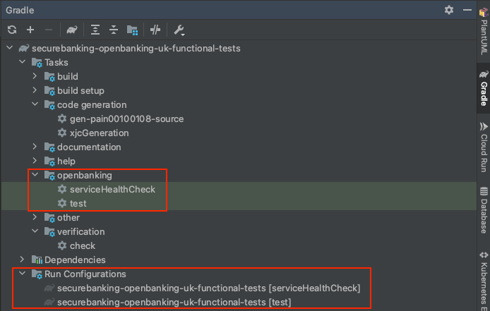

[](https://developer.forgerock.com/)

| |Current Status|
|---|---|
|Build|[](https://actions-badge.atrox.dev/SecureBankingAcceleratorToolkit/securebanking-openbanking-uk-functional-tests/goto?ref=master)|
|Release|[](https://img.shields.io/github/v/release/SecureBankingAcceleratorToolkit/securebanking-openbanking-uk-functional-tests)
|License||

# securebanking functional tests (Open Banking UK)
Software testing to validate and coverage the implemented open banking functionalities and ensure that these satisfies the functional requirements.

## Setup
- Gradle 7.1.1
- Kotlin 1.4.20
- Java 14

It's important to have the VM argument `-Djunit.jupiter.extensions.autodetection.enabled=true` when running the tests.
Fortunately this is already in the tasks defined in the gradle configuration in the [build.gradle.kts](./build.gradle.kts). This VM argument tells JUnit to automatically load the ExecutionCondition
[modules](./src/test/kotlin/com/forgerock/openbanking/junit) defined in [org.junit.jupiter.api.extension.Extension](./src/test/resources/META-INF/services/org.junit.jupiter.api.extension.Extension).

For more information https://junit.org/junit5/docs/5.7.0/user-guide/index.html#extensions-registration-automatic

## Adding a new ExecutionCondition

1. Copy from [examples](./src/test/kotlin/com/forgerock/openbanking/junit)
1. Update the execution condition logic
1. Add FQN of ExecutionCondition class to [org.junit.jupiter.api.extension.Extension](./src/test/resources/META-INF/services/org.junit.jupiter.api.extension.Extension)
1. Add your annotations to classes

## tasks


| Code Generation | Description |
|---|---|
| gen-pain00100108-source | Generate sources for the schema schema-pain.001.001.08 |
| xjcGeneration | Run all XJC tasks |

| Forgerock | Description |
| --- | --- |
| generateTestJar | Generate a non-executable jar library tests |

| Forgerock-tests | Description |
| --- | --- |
| accessToken | Runs the access token tests |
| account | Runs the account tests |
| bank | Runs the bank tests |
| directory | Runs the directory tests |
| registration | Runs the dynamic registration tests |
| matls | Runs the matls tests |
| payment | Runs the payment tests |
| serviceHealthCheck | Runs the test to check the service status |
| all | Runs ALL tests |

| Forgerock-tests-events | Description |
| --- | --- |
| all.events | Runs all event tests |
| aggregatedpolling | Runs the aggregated polling tests |
| callbacks | Runs the callback tests |
| subscriptions | Runs the subscription tests |

| Forgerock-tests-payments | Description |
| --- | --- |
| all.payments | Runs all payment tests |
| domesticPayments | Runs the domestic payment tests |
| filePayments | Runs the file payment tests |
| internationalPayments | Runs the international payment tests |

## Run single Test on Intellij using JUnit platform
1. Go to `IntelliJ IDEA > preferences > build, execution, deployment > build tools > Gradle`
1. Set `Run tests using` to `IntelliJ IDEA`
1. Set `Gradle JVM` to `java version 14`
   
1. Go to `Run/Debug configuration` and `Edit configuration`
   
1. Go to properties for `JUnit` template on `Edit templates`
   
1. Set the `DOMAIN` environment variable value

> This template will use every time you run a new `single test`.
> You can change the Junit template all the times you want

> If you run a test on IntelliJ you can change later the DOMAIN value editing the test configuration
> to run the test against another DOMAIN


## Run tests on IntelliJ using Gradle


## Run gradle tests manually
> When a task has been run and you want to run again the test task you need use the flag `--rerun-tasks` to avoid
> the UP-TO-DATE gradle check
   
```bash
gradle all [--rerun-tasks] [-Pdomain]
  ``` 
### All test
  ```bash
  gradle all [-Pdomain]
  ``` 
  Examples
  ```bash
  gradle all
  # The default 'DOMAIN' value has been set in the variable 'domain' defined on the 'build.gradle.kts' file
  ```
  ```bash
  gradle all -Pdomain="dev-ob.forgerock.financial:8074"
  ```
### A Specific task, set of tests
  ```bash
  gradle <TASK> [-Pdomain]
  ``` 
  Examples
  ```bash
  gradle payment
  # The default 'DOMAIN' value has been set in the variable 'domain' defined on the 'build.gradle.kts' file
  ```
  ```bash
  gradle payment -Pdomain="dev-ob.forgerock.financial:8074"
  ```
### Single test 
  ```bash
  gradle test --tests "x.x.y.y.TestClass.testMethod" [-Pdomain]
  ```
  Example 
  ```bash
  gradle test --tests "com.forgerock.securebanking.openbanking.uk.payment.domestic.SingleDomesticPaymentTest.shouldCreateSingleDomesticPayment_v3_1_2" -Pdomain="dev-ob.forgerock.financial:8074"
  ```
