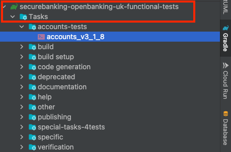

[](https://developer.forgerock.com/)

|         | Current Status                                                                                                                                                                                                                                                                                                                                      |
|---------|-----------------------------------------------------------------------------------------------------------------------------------------------------------------------------------------------------------------------------------------------------------------------------------------------------------------------------------------------------|
| Build   | [](https://actions-badge.atrox.dev/SecureApiGateway/secure-api-gateway-ob-uk-functional-tests/goto?ref=master) |
| Release | [](https://img.shields.io/github/v/release/SecureApiGateway/secure-api-gateway-ob-uk-functional-tests)                                                              |
| License |                                                                                                                                                                                                                                                                                      |

# Secure API Gateway functional tests (Open Banking UK)
Software testing to validate and coverage the implemented open banking functionalities and ensure that these satisfies the functional requirements.

## Setup
- Gradle 7.4.2
- Kotlin 1.4.20
- Java 14
- OB certificates

It's important to have the VM argument `-Djunit.jupiter.extensions.autodetection.enabled=true` when running the tests.
Fortunately this is already in the tasks defined in the gradle configuration in the [build.gradle.kts](./build.gradle.kts). This VM argument tells JUnit to automatically load the ExecutionCondition
[modules](./src/test/kotlin/com/forgerock/sapi/gateway/framework/extensions/junit) defined in [org.junit.jupiter.api.extension.Extension](./src/test/resources/META-INF/services/org.junit.jupiter.api.extension.Extension).

For more information https://junit.org/junit5/docs/5.7.0/user-guide/index.html#extensions-registration-automatic

### `source` Folders structure
- **_src/test/kotlin/com/forgerock/sapi/gateway_**: The root folder source structure.

- **_{Root}/framework_**: Folder source container that contains all related with the functional tests transversal framework for generic purposes.
- **_{Root}/ob/uk_**: Folder source container that contains all related with a specific functional test implementation for Open banking UK spec.
  - **_/framework_**: configuration, constants etc for uk spec tests
  - **_/support_**: instrumentalization support classes for uk spec tests
  - **_/tests_**: Where functional tests implementation live.

### Set up the certificates for test purposes
The certificates are protected, and you can't find them in the repository, for that reason to run the functional tests in local environments is necessary set the OB certificates:
- Create the folder `certificates` in the root project folder

**ForgeRock code owners**
- Get the certificates from [sapig-ci-secrets](https://github.com/ForgeCloud/sapig-ci-secrets/tree/main/ob-directory-certs/tpp-SAPIG-automating-testing) and decrypt them:
  - OBWac.key
  - OBWac.pem
  - OBSeal.key
  - OBSeal.pem

**Customers**
- Obtain your TPP OB certificates for test purposes from OB directory:
  - OBWac.key
  - OBWac.pem
  - OBSeal.key
  - OBSeal.pem

- Copy the certificates to `certificates` folder created in the above step.

## Adding a new ExecutionCondition
1. Copy from [examples](./src/test/kotlin/com/forgerock/sapi/gateway/framework/extensions/junit)
1. Update the execution condition logic
1. Add FQN of ExecutionCondition class to [org.junit.jupiter.api.extension.Extension](./src/test/resources/META-INF/services/org.junit.jupiter.api.extension.Extension)
1. Add your annotations to classes

## Profiles
Functional test project has been implemented with a gradle strategy to be able to run the tests 
against different environments using different profiles files, let's go how works.

The profiles file lives in `gradle/profiles` folder, and they need to be named following the pattern `profile-${profile-name}.gradle.kts`
as example we provide the default profile `profile-dev.gradle.kts`, with all mandatory properties, where `dev` is the `${profile-name}`.

For default the functional tests are executed with the `dev` profile if another profile is not provided. 

The `profile-${profile-name}.gradle.kts` file contains all properties/values that will be necessary to run the tests against an environment.

## How run tests with a custom profile?
First you will need to create a new profile file in `gradle/profile` following the pattern defined for the profile file name.
Example: `gradle/profile/profile-MY_CUSTOM_PROFILE_NAME.gradle.kts`

To use your new profile you can pass the profile name by command line.
```shell
gradle -Pprofile=MY_CUSTOM_PROFILE_NAME
```
**Check your values**
```shell
gradle properties -q -Pprofile=dev
```
```shell
gradle properties -q -Pprofile=dev
```
### How overwrite a property supplied by a profile file?
To overwrite a property defined in a profile file we can use system properties passed by command line.

**Example command line to overwrite a project property defined by profile**
```shell
gradle -DpropertyName=someValue -DpropertyName2=someValue -DpropertyName3=someValue ...
```
```shell
gradle -Pprofile=MY_CUSTOM_PROFILE_NAME -DpropertyName=newValue -DpropertyName2=newValue -DpropertyName3=newValue ...
```
> The logic implemented in build gradle will overwrite the project property `propertyName` with the new value passed by command line.
> The `properyName` need match with a property defined in the profile file to be overwrites

# tasks
The tasks are grouped by types


| Code Generation         | Description                                            |
|-------------------------|--------------------------------------------------------|
| gen-pain00100108-source | Generate sources for the schema schema-pain.001.001.08 |
| xjcGeneration           | Run all XJC tasks                                      |

| specific           | Description                                                                                                       |
|--------------------|-------------------------------------------------------------------------------------------------------------------|
| generateTestJar    | Generate a non-executable jar library tests                                                                       |

| accounts-tests     | Description                                |
|--------------------|--------------------------------------------|
| accounts_v3_1_8    | Runs the accounts tests for version v3.1.8 |

| domestic-payments-tests  | Description                                         |
|--------------------------|-----------------------------------------------------|
| domestic_payments_v3_1_8 | Runs the domestic payments tests for version v3.1.8 |

| tests         | Description                                                       |
|---------------|-------------------------------------------------------------------|
| tests_v3_1_8  | Runs the accounts and domestic payments tests for version v3.1.8  |
| tests_v3_1_9  | Runs the accounts and domestic payments tests for version v3.1.9  |
| tests_v3_1_10 | Runs the accounts and domestic payments tests for version v3.1.10 |

| deprecated | Description                                                         |
|------------|---------------------------------------------------------------------|
| N/A        | All test tasks that have been deprecated for that strategic version |

## Run single Test on Intellij using JUnit platform
1. Go to `IntelliJ IDEA > preferences > build, execution, deployment > build tools > Gradle`
2. Set `Build and run using` to `Gradle`
3. Set `Run tests using` to `Gradle`
4. Set `use gradle from` to 'gradle-wrapper.properties' file
5. Set `Gradle JVM` to `java version 14`
   
6. Go to `Run/Debug configuration` and `Edit configuration`
   
7. Go to properties for `Gradle` template and add a new run configuration
   
8. Add in `Run` the task name and the profile `-Pprofile=jorge` (the profile is optional, the default profile will be applied if `-Pprofile` isn't set)

**Run configuration examples**

| Run                                                                                                                                               | profile | Description                                                                                                               |
|---------------------------------------------------------------------------------------------------------------------------------------------------|---------|---------------------------------------------------------------------------------------------------------------------------|
| `accounts_v3_1_8`                                                                                                                                 | dev     | runs the task `accounts_v3_1_8` with profile `profile-dev.gradle.kts`                                                     |
| `accounts_v3_1_8 -Pprofile=dev`                                                                                                                   | dev     | runs the task with the profile `profile-dev.gradle.kts`                                                                   |
| `:singleTest --tests "com.forgerock.sapi.gateway.ob.uk.tests.functional.account.parties.GetPartyTest.shouldGetParty_v3_1_8" -Pprofile=dev`        | dev     | Runs the single test method `shouldGetParty_v3_1_8` defined on `GetPartyTest` with `profile-dev.gradle.kts` profile       |
| `:singleTest --tests "com.forgerock.sapi.gateway.ob.uk.tests.functional.account.accounts.GetAccountsTest.shouldGetAccounts_v3_1_8" -Pprofile=dev` | dev     | Runs the single test method `shouldGetAccounts_v3_1_8` defined on `GetAccountsTest` with `profile-dev.gradle.kts` profile |

## Run gradle tests manually
> When a task has been run, and you want to run again the test task you need use the flag `--rerun-tasks` to avoid
> the UP-TO-DATE gradle check
   
```bash
gradle all [--rerun-tasks] [-Pprofile]
  ``` 
### All test
  ```bash
  gradle all [-Pprofile]
  ``` 
  Examples
  ```bash
  gradle all
  # The default 'DOMAIN' value has been set in the variable 'domain' defined on the 'build.gradle.kts' file
  ```
  ```bash
  gradle all -Pprofile=my-profile
  ```
### A Specific task, set of tests
  ```bash
  gradle <TASK> [-Pprofile]
  ``` 
  Examples
  ```bash
  gradle payment
  ```
  ```bash
  gradle payment -Pprofile=my-profile
  ```
### Single test 
  ```bash
  gradle test --tests "x.x.y.y.TestClass.testMethod" [-Pprofile]
  ```
  Example 
  ```bash
  gradle test --tests "com.forgerock.sapi.gateway.ob.uk.tests.payment.domestic.SingleDomesticPaymentTest.shouldCreateSingleDomesticPayment_v3_1_2" -Pprofile=my-profile
  ```
# Pipelines
## Codefresh pipeline variables table

| Name       | Mandatory                       | Description                                                                                                                                                        |
|------------|---------------------------------|--------------------------------------------------------------------------------------------------------------------------------------------------------------------|
| SPEC_IMAGE | YES                             | Define the value of the image used for functional tests by spec implementation (ex. uk-functional-tests, <spec>-functional-tests)                                  |
| TAG        | YES                             | Define the image tag                                                                                                                                               |
| TEST_TASK  | YES                             | Define the test task to be executed by gradle (ex. `tests_v3_1_8`, `accounts_v3_1_8`)                                                                              |
| PROFILE    | NO (default profile: `default`) | Define which properties profile file will be load by gradle in the execution to inject the properties of a specific environment. (ex. `default`, `dev`, `nightly`) |

## Run Codefresh functional tests pipeline manually
- Go to [codefresh](https://codefresh.io/) and sing in up.
- Go to the pipeline `ForgeCloud/sbat-infra/functional-tests`
- When Run you need to ensure that the variables values are the correct values that you want.
## Run Codefresh functional tests pipeline from github actions
To run the codefresh pipeline from a github action add the below step to your action descriptor.
```yaml
  - name: 'run functional tests'
    uses: codefresh-io/codefresh-pipeline-runner@master
    with:
      args: '-v SPEC_IMAGE=uk-functional-tests -v TAG=latest -v TEST_TASK=tests_v3_1_8' # PROFILE isn't mandatory, no profile provided to use the default
    env:
      PIPELINE_NAME: 'ForgeCloud/sbat-infra/functional-tests'
      CF_API_KEY: ${{ secrets.CF_API_KEY }}
    id: run-pipeline
```
## Run the functional tests pipeline from another codefresh pipeline
To run the functional tests pipeline from another codefresh pipeline add the below step to your pipeline.
```yaml
call_uk_functional_tests_pipeline:
    title: Initialise cluster
    stage: configure-kubernetes
    type: codefresh-run
    arguments:
      PIPELINE_ID: ForgeCloud/sbat-infra/functional-tests
      VARIABLE:
        - SPEC_IMAGE=uk-functional-tests
        - TAG=latest
        - TEST_TASK=tests_v3_1_8
        # PROFILE isn't mandatory, no profile provided to use the default
    # add conditions directive if necessary
```
